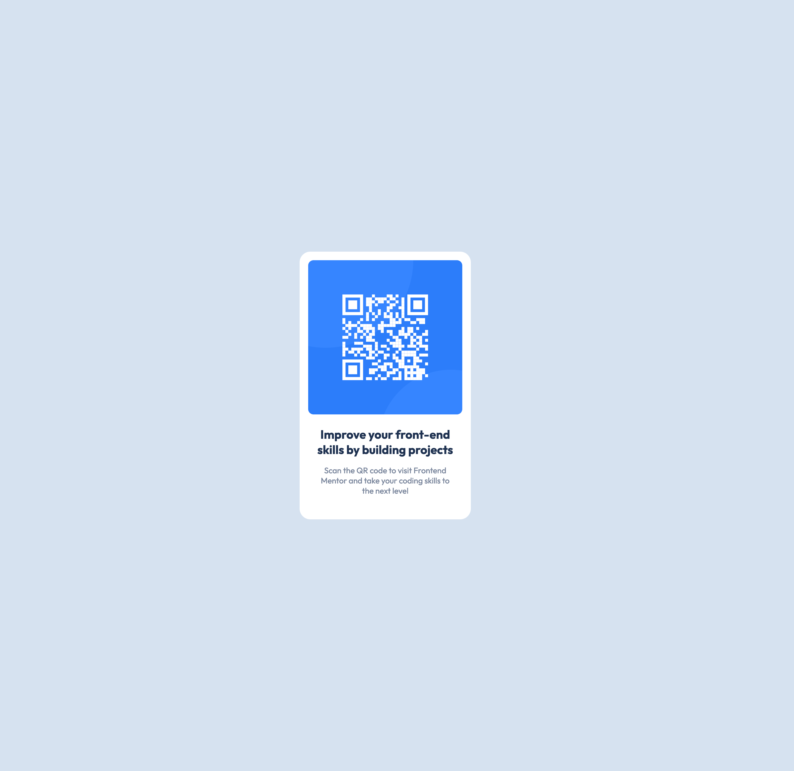

# Frontend Mentor - QR code component solution

This is a solution to the [QR code component challenge on Frontend Mentor](https://www.frontendmentor.io/challenges/qr-code-component-iux_sIO_H). Frontend Mentor challenges help you improve your coding skills by building realistic projects.

## Table of contents

- [Overview](#overview)
  - [Screenshot](#screenshot)
  - [Links](#links)
- [My process](#my-process)
  - [Built with](#built-with)
  - [What I learned](#what-i-learned)
  - [Continued development](#continued-development)
  - [Useful resources](#useful-resources)
- [Author](#author)
- [Acknowledgments](#acknowledgments)

**Note: Delete this note and update the table of contents based on what sections you keep.**

## Overview

### Screenshot

Desktop/Mobile

### Links

- Live Site URL: [Github Pages](https://maksym-paselsky.github.io/qr-code-component-main/)

## My process

### Built with

- Semantic HTML5 markup
- CSS custom properties
- Flexbox

### What I learned

That I don't need to overuse flexbox and calculate absolute position of each element but instead use block element and manipulate a margin.

### Continued development

Not confident with Positioning and Responsiveness

## Author

- Frontend Mentor - [@Maksym-Paselsky](https://www.frontendmentor.io/profile/Maksym-Paselsky)
